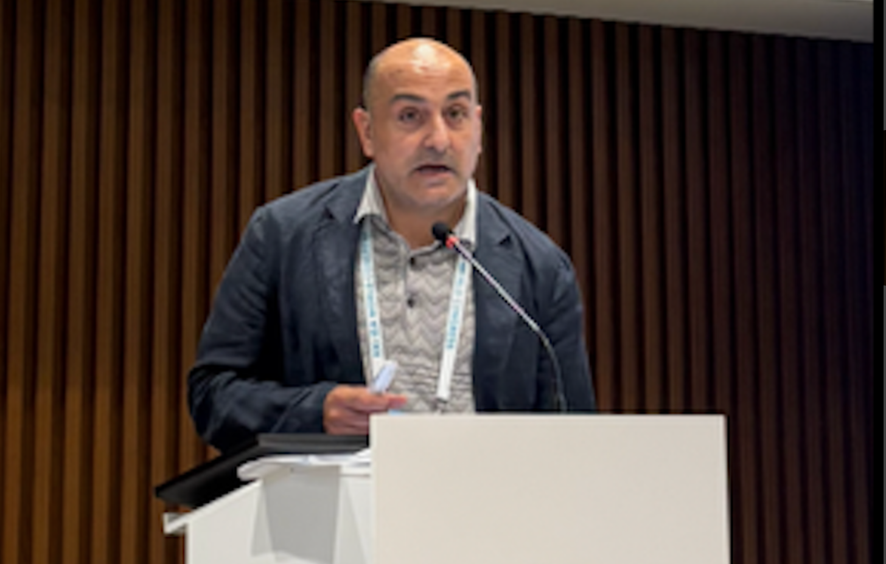
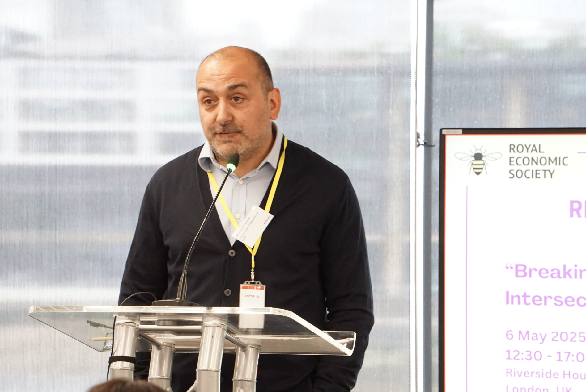

<table>
<tr>

<td width="70%" valign="top">
  
# Giovanni Razzu

I am a Professor of Economics whose research focuses on socio-economic inequality and the economic and social processes that shape opportunities and life chances. Much of my work has examined gender inequalities and labour market outcomes, while also addressing broader questions relating to intersectional inequalities, intergenerational mobility, and the distribution of economic opportunities across individuals and households. I am interested in understanding how economic institutions, social norms, public policies, and individual behaviours interact to produce unequal outcomes. Before joining the University of Reading, I worked as a Government Economist in a number of UK government departments, including the Office of the Deputy Prime Minister, the Cabinet Office and the Government Equalities Office. During this time, I worked on a range of policy issues relating to economic and social inequality. At the Government Equalities Office, I served as Acting Chief Economist and led the Secretariat to the National Equality Panel, which produced the landmark report *An Anatomy of Economic Inequality in the UK* (2010).

My research covers both microeconomics and macroeconomics. Methodologically, I draw on a range of approaches, including applied econometric analysis, laboratory and field experiments, and policy evaluation. While much of my work is empirical, I also value theoretical contributions and their role in helping us understand complex economic and social phenomena.

I view economics as a diverse discipline that benefits from a plurality of approaches, perspectives, and methods. Different models and analytical frameworks can shed light on different dimensions of the same problem. This broad-church understanding of economics has shaped both my research and my engagement with the profession. I am strongly committed to promoting equality, diversity and inclusion within economics and higher education. Over the years, I have contributed to a number of national and international initiatives aimed at widening participation, improving representation, and fostering more inclusive professional environments. These roles have included membership of the Expert Advisory Panel of the European Institute for Gender Equality (EIGE) and the UK Research and Innovation (UKRI) Advisory Panel on Equality, Diversity and Inclusion. I currently serve on the Trustee Board of the Royal Economic Society, with oversight responsibilities relating to diversity, inclusion and professional conduct. Through these and other activities, I seek to contribute to a profession that better reflects the diversity of the societies it studies and serves.

</td>

<td width="30%" valign="top">
 

  

</td>
 
</tr>
</table>

## Contact

**Email:** g.razzu@reading.ac.uk

### Profiles and Links

- Curriculum Vitae
- Google Scholar
- ORCID24
- RePEc25
- ResearchGate

</td>

<td width="30%" valign="top">

giovannirazzu-photo.png" width="250">  

giovannirazzu-RESphoto.png

</td>

</tr>
</table>

